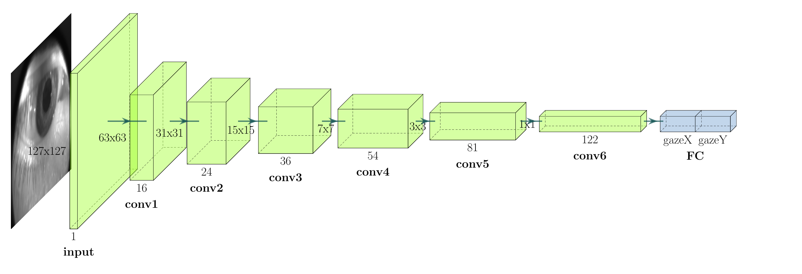
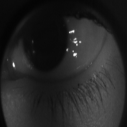
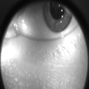
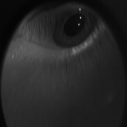

# Acomoeye-NN: NVGaze gaze estimation with upgrades

Implementation of one-shot direct gaze estimation NN based on NVGaze as described in [Nvidia paper](https://dl.acm.org/doi/10.1145/3290605.3300780 "NVGaze: An Anatomically-Informed Dataset for Low-Latency, Near-Eye Gaze Estimation"). In a long run, the project aims to implement low latency eye-tracking for VR/AR goggles' high demands. The implementation is based on Intel's Openvino training extension from [license plate repo](https://github.com/opencv/openvino_training_extensions/tree/develop/tensorflow_toolkit/lpr "OpenVINO™ Training Extensions, License Plate Recognition").




I have added few additional techniques to upgrade base NVGaze implementation, which you can turn on/off in config:

* :watermelon: coordConv ([paper](https://arxiv.org/abs/1807.03247))
* :watermelon: globalContext ([paper](https://arxiv.org/abs/1904.11492))
* :watermelon: coarseDropout ([example](https://www.kaggle.com/c/siim-isic-melanoma-classification/discussion/169721))
* :watermelon: fireBlocks ([code](https://github.com/opencv/openvino_training_extensions/tree/develop/tensorflow_toolkit/lpr))
* :watermelon: selfAttention ([paper](https://arxiv.org/abs/1706.03762))


I have achieved ~2.5° angular generalization error on Acomo-14 dataset, with base implementation as fast as 0.36 ms inference in openvino :tada:.


# Quick Start Guide

## Install deps Windows/Linux:

1. install nvidia driver which support at least cuda 10.0
2. download & install :snake: [anaconda](https://www.anaconda.com/products/individual "anaconda") ; set anaconda PATH (may check 'set Path as default' on Windows installer)

```
conda create -n tf_gpu python=3.6
conda activate tf_gpu	
conda install -c anaconda tensorflow-gpu=1.15
conda install -c conda-forge opencv=3.4
conda install -c anaconda cython
conda install -c conda-forge imgaug
git clone https://github.com/czero69/acomoeye-NN.git
```

## Datasets Acomo-14

Dataset for 8 subjects in 14 tests, 49 gaze points each test. Each gaze point has 1k photos of 'narrowing' pupil with gaze direction label: gazeX (yaw), gazeY (pitch). Rotations are applied in order yaw, pitch as extrinsic rotation. Note that it is different notation compared to NVGaze datasets. Dataset was gathered with a 300Hz IR camera mounted in Oculus DK2 on 40°x40° FOV. Dataset is ready to be trained, images are cropped and resized to 127x127.

[Download](https://drive.google.com/file/d/1F2n6a8vaA0x0JilqDAC9d3dmC4Xgwc1R/view?usp=sharing "acomoeye-14 dataset") Acomo-14 dataset.

- :zap: for train use: Train6-merged-monocular-R-shuffled-train.csv	(80% gaze points from 7 subjects in 13 tests)
- :zap: for valid use: Train6-merged-monocular-R-shuffled-test-SMALL.csv (100% gaze points from 1 unseen subject plus 20% gaze points from 7 subjects in 13 tests)

     

## Run
Edit paths for train and eval in .config.py:
```
cd tensorflow_toolkit/eyetracking/
gedit acomo_basic/config.py
```
Training & eval:
```
python tools/train.py acomo_basic/config.py
python tools/eval.py acomo_basic/config.py
```
You can run train and eval concurrently, so later you can plot per-subject accuracies in tensorboard.

## Tips

To run eval or training on tensorflow CPU and not GPU set in .config in eval/train class:
```
CUDA_VISIBLE_DEVICES = ""
```

To export openvino model (you must install openvino environment, see below):
```
python tools/export.py --data_type FP32 acomo_basic/config.py
```

To check out openvino inference engine, 79000 - exported iteration number:
```
python tools/infer_ie.py --model model_acomo_basic/export_79000/IR/FP32/eyenet.xml --config acomo_basic/config.py /path/to/img/0005353.png
```

To plot loss, accuracies, per-subject accuracies etc. run tensorboard:
```
cd ./model_acomo_basic
tensorboard --logdir ./ --port 5999
localhost:5999		# paste in web browser
```

# Results

| <sub>inference engine</sub> | <sub>baseline</sub> | <sub><b>c</b>oord-<br>Conv</sub> | <sub><b>g</b>lobal-<br>Context</sub> | <sub>coarse-<br><b>D</b>ropout</sub> | <sub><b>f</b>ireBlocks</sub> | <sub><b>a</b>ttention</sub> | <sub><b>cgDa</b></sub> | <sub><b>cgDaf</b></sub> |
| ---------------- |:--------:|:---------:|:-------:|:-------:|:---------:|:---------:|:----:|:-----:|
| <sub>tf-gpu (ms)</sub>      | <sub>0.7568</sub>   | <sub>0.7691</sub>    | <sub>1.2115</sub>  | <sub>0.7636</sub>  | <sub>1.5305</sub>    | <sub>0.8589</sub>    |<sub>1.3492</sub>|<sub>2.0812</sub> |
| <sub>tf-cpu (ms)</sub>      | <sub>0.6877</sub>   | <sub>0.8687</sub>    | <sub><b>0.9158</b></sub>  | <sub>0.6959</sub>  | <sub>1.1433</sub>    | <sub>0.7450</sub>    |<sub><b>1.1114</b></sub>|<sub>2.0415</sub> |
| <sub>openvino-cpu (ms)</sub>| <sub><b>0.3621</b></sub>   | <sub><b>0.3977</b></sub>    | <sub>1.0357</sub>  | <sub><b>0.3643</b></sub>  | <sub>0.6118</sub>    | <sub>0.4936</sub>    |<sub>1.2463</sub>|<sub><b>1.4081</b></sub> |
| ---------------- | -------- | --------- | ------- | ------- | --------- | --------- | ---- | ----- |
| <sub>parameters count</sub> | <sub>157755</sub>   | <sub>158043</sub>    | <sub>158459</sub>  | <sub>157755</sub>  | <sub>22424</sub>     | <sub>159853</sub>    |<sub>160845</sub>|<sub>25514</sub>  |

Table 1. Inference time for 127x127 input and first layer L=16.


| <sub>Dataset raw/calibrated</sub>| <sub>baseline</sub> | <sub><b>c</b>oord-<br>conv</sub> | <sub><b>g</b>lobal-<br>context</sub> | <sub>coarse-<br><b>d</b>ropout</sub> | <sub><b>f</b>ireBlock</sub> | <sub><b>a</b>ttention</sub> | <sub><b>cgda</b></sub> | <sub><b>cgdaf</b></sub> |
| ------------------------ |:--------:|:---------:|:-------:|:-------:|:---------:|:---------:|:----:|:-----:|
| <sub>NVGaze-AR (2/40)</sub>   |<sub>6.37°<br>4.88°</sub>|<sub><b>6.16°</b><br><b>3.81°</b></sub>|<sub>6.93°<br>4.43°</sub>|<sub>7.34°<br>5.34°</sub>|<sub>6.41°<br>4.91°</sub>|<sub>6.41°<br>4.99°</sub>|<sub>9.40°<br>5.65°</sub>|<sub>9.64°<br>6.46°</sub>|
| <sub>NVGaze-VR (4/9)</sub>          |<sub>3.49°<br>2.33°</sub>|<sub>3.00°<br>2.51°</sub>|<sub>3.30°<br>2.57°</sub>|<sub>3.58°<br>2.63°</sub>|<sub>3.27°<br>2.67°</sub>|<sub>3.04°<br><b>2.29°</b></sub>|<sub><b>2.79°</b><br>2.47°</sub>|<sub>3.21°<br>2.69°</sub>|
| <sub>Acomo (1/8)</sub>              |<sub>5.24°<br>3.44°</sub>|<sub>4.93°<br>3.48°</sub>|<sub>5.11°<br>2.68°</sub>|<sub>6.17°<br>3.66°</sub>|<sub>4.23°<br>3.28°</sub>|<sub>4.86°<br>3.22°</sub>|<sub>7.51°<br>3.86°</sub>|<sub><b>3.99°</b><br><b>2.57°</b></sub>|

Table 2. Generalization for unseen subjects, angular error in degrees, trained for 1M iterations. Error with affine calibration (calibrated, bottom) and without affine calibration (raw, upper) is reported. (N/T), N - number of the subject when test, T - number of the subject when train. NVGaze Datasets were used 'as is' forex. NVGaze-AR was not cropped to pupil location. Input res: 127x127, first layer L=16.

| <sub>Dataset raw/calibrated</sub>| <sub>baseline</sub> | <sub><b>c</b>oord-<br>conv</sub> | <sub><b>g</b>lobal-<br>context</sub> | <sub>coarse-<br><b>d</b>ropout</sub> | <sub><b>f</b>ireBlock</sub> | <sub><b>a</b>ttention</sub> | <sub><b>cgda</b></sub> | <sub><b>cgdaf</b></sub> |
| ------------------------ |:--------:|:---------:|:-------:|:-------:|:---------:|:---------:|:----:|:-----:|
| <sub>NVGaze-syntetic (40)</sub> | <sub>2.31°<br>2.09°</sub> | <sub>2.27°<br>2.14°</sub> | <sub>2.23°<br>2.04°</sub> |  <sub>2.25°<br>2.13°</sub> | <sub>2.15°<br>2.07°</sub> | <sub><b>1.79°</b><br><b>1.69°</b></sub> | <sub>1.99°<br>1.95°</sub> | <sub>1.88°<br>1.76°</sub> |
| <sub>NVGaze-AR (42)</sub> | <sub>3.76°<br>3.23°</sub> | <sub>3.51°<br><b>2.87°</b></sub> | <sub>3.81°<br>3.17°</sub> | <sub>3.95°<br>3.36°</sub> | <sub>3.95°<br>3.43°</sub> | <sub><b>3.45°</b><br>3.00°</sub> | <sub>4.10°<br>3.32°</sub> | <sub>4.37°<br>3.61°</sub> |
| <sub>NVGaze-VR (9)</sub> | <sub>2.89°<br>2.48°</sub> | <sub>2.52°<br><b>2.09°</b></sub> | <sub>2.62°<br>2.16°</sub> | <sub>2.73°<br>2.28°</sub> | <sub>2.86°<br>2.55°</sub> | <sub>2.63°<br>2.34°</sub> | <sub><b>2.42°</b><br>2.26°</sub> | <sub>2.45°<br>2.24°</sub> |
| <sub>Acomo (8)</sub>  | <sub>4.05°<br>3.01°</sub> | <sub>3.84°<br>2.97°</sub> | <sub>3.72°<br><b>2.66°</b></sub> | <sub>4.39°<br>3.24°</sub> | <sub>3.51°<br>2.97°</sub> | <sub>3.84°<br>2.98°</sub> | <sub>4.50°<br>3.21°</sub> | <sub><b>3.41°</b><br>2.67°</sub> |

Table 3. Generalization for new gaze vectors (amongst known subjects), angular error in degrees, trained for 1M iterations. Error with affine calibration (calibrated, bottom) and without affine calibration (raw, upper) is reported. (N), N - number of the subject when test. NVGaze Datasets were used 'as is' forex. NVGaze-AR was not cropped to pupil location. Input res: 127x127, first layer L=16.

Choosing the best upgrade technique for each dataset, proposed upgrades gives better avaraged accuracy, as follows:
- -0.82° generalization new subject raw error
- -0.70° generalization new subject affine calibrated error
- -0.51° generalization new gaze vectors raw error
- -0.38° generalization new gaze vectors affine calibrated error


# OpenVINO Training Extensions

OpenVINO Training Extensions provide a convenient environment to train
Deep Learning models and convert them using [OpenVINO™
Toolkit](https://software.intel.com/en-us/openvino-toolkit) for optimized
inference.


## Setup OpenVINO Training Extensions

1. Clone repository in the working directory

  ```
  cd /<path_to_working_dir>
  git clone https://github.com/opencv/openvino_training_extensions.git
  ```

2. Install prerequisites

  ```
  sudo apt-get install libturbojpeg python3-tk python3-pip virtualenv
  ```

## Citation

Please cite NVGaze paper if you use this NN architecture:
```
@inproceedings{kim2019,
	author = {Kim, Joohwan and Stengel, Michael and Majercik, Alexander and De Mello, Shalini and Dunn, David and Laine, Samuli and McGuire, Morgan and Luebke, David},
	title = {NVGaze: An Anatomically-Informed Dataset for Low-Latency, Near-Eye Gaze Estimation},
	booktitle = {Proceedings of the SIGCHI Conference on Human Factors in Computing Systems},
	series = {CHI '19},
	year = {2019},
	isbn = {978-1-4503-5970-2/19/05},
	location = {Glasgow, Scotland UK},
	numpages = {10},
	url = {https://sites.google.com/nvidia.com/nvgaze},
	doi = {10.1145/3290605.3300780},
	acmid = {978-1-4503-5970-2/19/05},
	publisher = {ACM},
	address = {New York, NY, USA},
	keywords = {eye tracking, machine learning, dataset, virtual reality},
}
```

```
@INPROCEEDINGS{7410785,
  author={E. {Wood} and T. {Baltruaitis} and X. {Zhang} and Y. {Sugano} and P. {Robinson} and A. {Bulling}},
  booktitle={2015 IEEE International Conference on Computer Vision (ICCV)}, 
  title={Rendering of Eyes for Eye-Shape Registration and Gaze Estimation}, 
  year={2015},
  volume={},
  number={},
  pages={3756-3764},}
```

If you find *LPRNet* useful in your research, or you are using FireBlocks implementation, please, consider to cite the following paper:

```
@article{icv2018lprnet,
title={LPRNet: License Plate Recognition via Deep Neural Networks},
author={Sergey Zherzdev and Alexey Gruzdev},
journal={arXiv:1806.10447},
year={2018}
}
```

